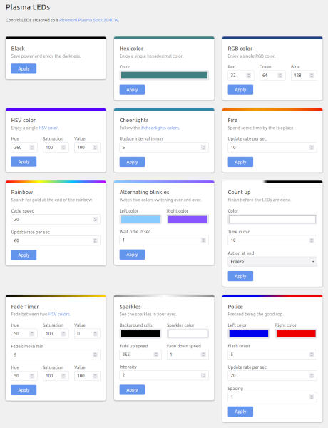

# Plasma LEDs

Control LEDs attached to a [Pimoroni Plasma Stick 2040 W](https://shop.pimoroni.com/products/plasma-stick-2040-w) with your web browser.

## Features

The **Plasma LEDs** features a clean web frontend, which allows you to control the LEDs attached to a [Pimoroni Plasma Stick 2040 W](https://shop.pimoroni.com/products/plasma-stick-2040-w) via a web browser.

It comes with a variety of configurable colors and effects out of the box, and is extendable to additional effects if you have the programming skills.

Some of the effects are based on the awesome [example code provided by Pimoroni](https://github.com/pimoroni/pimoroni-pico/tree/main/micropython/examples/plasma_stick).

The **technology stack** is based on:

- The admirable [Pimoroni Plasma Stick 2040 W](https://shop.pimoroni.com/products/plasma-stick-2040-w), which is basically a [Raspberry Pi Pico W](https://www.raspberrypi.com/products/raspberry-pi-pico/) prepared for easy control of LED strips.
- Any LED strip of your choice, e.g. one of [Pimoroni's flexible RGB LED strips](https://shop.pimoroni.com/collections/flexible-rgb-led-strips).
- [MicroPython](https://micropython.org/), a lean and efficient Python implementation for microcontrollers.
- [Microdot](https://github.com/miguelgrinberg/microdot), the impossibly small web framework for Python and MicroPython.
- [Chota](https://jenil.github.io/chota/), a micro CSS framework.
- Hand-crafted Python, HTML, CSS and JavaScript code.

## Basic Setup of Plasma Stick

The basic setup of the [Pimoroni Plasma Stick 2040 W](https://shop.pimoroni.com/products/plasma-stick-2040-w) is described by Pimoroni in [Getting started with Raspberry Pi Pico](https://learn.pimoroni.com/tutorial/hel/getting-started-with-pico) and [Assembling Wireless Plasma Kit](https://learn.pimoroni.com/article/assembling-wireless-plasma-kit).

It boils down to:

- Download the latest MicroPython firmware starting with `pimoroni-picow` from the [Pimoroni releases](https://github.com/pimoroni/pimoroni-pico/releases) to your computer.
- Press the `BOOTSEL` button on your Plasma Stick while connecting the stick with a USB cable to your computer.
- The Plasma Stick should now show up as a drive called `RPI-RP2`, on which you have to copy the downloaded MicroPython firmware file to.

## Setup of Plasma LEDs

First, you have to **download the Plasma LEDs software to your computer**.

- Head over to the releases page and download the latest zip file for Plasma LEDs.

Then you have to **adapt the `config.py` file** to reflect the setup of your WiFi and your LED strip.
Minimally, you have to set the following config options:

- `COUNTRY` with the two-letter country code of your country, see [ISO 3166 country codes](https://en.wikipedia.org/wiki/List_of_ISO_3166_country_codes), e.g. `COUNTRY = "GB"` if you live in the UK, or `COUNTRY = "DE"` if you live in Germany.
- `SSID` with the SSID aka name of your WiFi network, e.g. `SSID = "MyWiFi"`.
- `KEY` with the key aka password of your WiFi network, e.g. `KEY = "12345"`.
- `NUM_LEDS` with the number of LEDs in your LED strip, e.g. `NUM_LEDS = 96`.
- `COLOR_ORDER` with the color order of your LED strip, e.g. `COLOR_ORDER = "RGB"`.
If the colors you set in the Plasma LEDs web site and the colors on your LED strip seem to be messed up, you likely have to change the color order in the config to match the color order of your LED strip.
Normally you can find the required information on the corresponding web site of your LED strip, e.g. on the company web site where you purchased the LED strip.

In addition, you can configure a static IP address for the Plasma Stick, which helps finding the right address to put into the address bar of the browser to access the Plasma LEDs web frontend.
To do so, set the four config options `IP`, `SUBNET`, `GATEWAY` and `DNS`.
Otherwise you have to lookup the IP address of the Plasma Stick through other means, e.g. via some config page of your WiFi router or WiFi tools / apps.

After adapting the configuration, you have to **upload the downloaded files to your Plasma Stick**.

- There are several tools available for the upload, e.g. [Visual Studio Code](https://code.visualstudio.com/) with the awesome [MicroPico](https://marketplace.visualstudio.com/items?itemName=paulober.pico-w-go) extension, [Thonny](https://thonny.org/) or [rshell](https://github.com/dhylands/rshell).

Finally, you can **plug in your Plasma Stick to a USB power source** and let the fun begin.

- If everything works correctly, the green onboard LED on the Plasma Stick will start to flash, indicating that the stick connects to your WiFi.
- If the green onboard LED stops flashing, then the WiFi connection is successful (or if not, the Plasma Stick reboots and it begins from the start).
- You can now kick of a web browser, e.g. on your computer or your mobile, and enter the IP address of your Plasma Stick in your browser.
Sometimes also simply calling http://picow works.
- Enjoy the Plasma LED web frontend and have fun running your favorite colors and effects on your LED strip.
- Your config is stored locally in the web browser.
If you don't delete the local storage of your web browser, then your setup will be there the next time you connect to the Plasma LED web site on the same computer or mobile.
